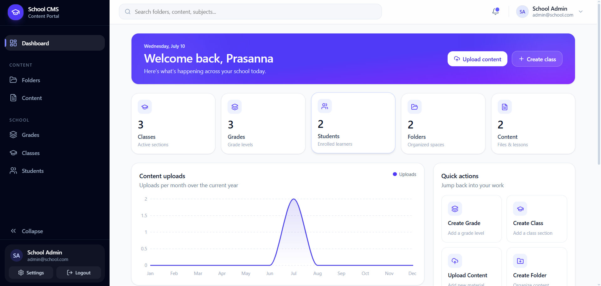

# 🎓 School Content Management Portal

A modern **full-stack School Content Management System** built for schools to manage grades, classes, students, learning content, and folders through a responsive web application and an Android mobile application.

> 🚀 Built with **React, TypeScript, Express.js, Prisma ORM, PostgreSQL, Tailwind CSS, and Capacitor**.

---

## 🔗 Project Links

🌐 **Live Web App:** https://school-content-management-portal.vercel.app/

📱 **Android APK:** https://drive.google.com/file/d/1WWXbG2jFD4TZpxRsiIUWd3fy52VmT2ua/view?usp=drive_link

🎥 **Demo Video:** https://drive.google.com/file/d/1mfeNmPhbHCNsVUbuRmPq1jWXqG53vjlB/view?usp=sharing

⚙️ **Backend API:** https://school-content-management-portal.onrender.com

---

## 📸 Dashboard Preview



---

## ✨ Key Features

### 🔐 Authentication & Security
- Secure JWT-based authentication
- School activation using activation codes
- Protected routes with role-based access

### 🏫 School Management
- Grade Management
- Class Management
- Student Management
- Folder Organization

### 📚 Content Management
- Upload learning materials
- Organize content by folders
- Manage educational resources

### 📊 Dashboard
- School overview
- Quick actions
- Analytics cards
- Recent activity

### 📱 Cross-Platform Access
- Responsive web application
- Android application built with Capacitor
- Cloud-connected backend and database

---

## 🛠 Tech Stack

| Category | Technologies |
|----------|--------------|
| Frontend | React, TypeScript, Vite, Tailwind CSS, shadcn/ui, Axios |
| Backend | Node.js, Express.js |
| Database | PostgreSQL (Neon) |
| ORM | Prisma |
| Mobile | Capacitor, Android Studio |
| Deployment | Vercel, Render |
| Version Control | Git, GitHub |

---

## 📂 Project Structure

```text
school-content-management-portal/
│
├── frontend-new/      # React + Vite frontend
├── server/            # Express backend
├── screenshots/       # Project screenshots
└── README.md
```

---

## 🚀 Installation

### 1. Clone the Repository

```bash
git clone https://github.com/puppalaleelaprasanna5-ux/school-content-management-portal.git
```

### 2. Install Frontend Dependencies

```bash
cd frontend-new
npm install
```

### 3. Install Backend Dependencies

```bash
cd ../server
npm install
```

### 4. Start the Backend

```bash
npm run dev
```

### 5. Start the Frontend

```bash
cd ../frontend-new
npm run dev
```

The application will be available at:

- Frontend → http://localhost:5173
- Backend → http://localhost:5000

---

## ⚙️ Environment Variables

### Frontend (`frontend-new/.env`)

```env
VITE_API_URL=https://school-content-management-portal.onrender.com/api
```

### Backend (`server/.env`)

```env
DATABASE_URL=your_neon_database_url
JWT_SECRET=your_secret_key
PORT=5000
```

> **Note:** Do not commit your `.env` files or real secrets to GitHub.

---

## 📱 Android Application

This project also includes an Android application built using **Capacitor**.

To run it locally:

```bash
npm run build
npx cap sync android
npx cap open android
```

You can also download the pre-built APK from the link above.

---

## ☁️ Deployment

| Service | Platform |
|---------|----------|
| Frontend | Vercel |
| Backend | Render |
| Database | Neon PostgreSQL |
| Mobile App | Capacitor (Android) |

---

## 🚀 Future Enhancements

The following features are planned for future releases:

- 👨‍🏫 Teacher Portal
- 👨‍👩‍👧 Parent Portal
- 📅 Attendance Management
- 📝 Assignment & Quiz Module
- 📆 Timetable Management
- 🔔 Push Notifications
- 📊 Advanced Analytics Dashboard
- 🤖 AI-powered Content Recommendations
- 📱 iOS Application using Capacitor

---

## 👨‍💻 Author

**Leela Prasanna**

- GitHub: https://github.com/puppalaleelaprasanna5-ux
- LinkedIn: *(Add your LinkedIn profile URL here)*

---

## 📄 License

This project was developed for educational purposes and as part of a software development portfolio.

---

<div align="center">

⭐ If you found this project interesting, consider giving it a star on GitHub.

Made with ❤️ by **Leela Prasanna**

</div>